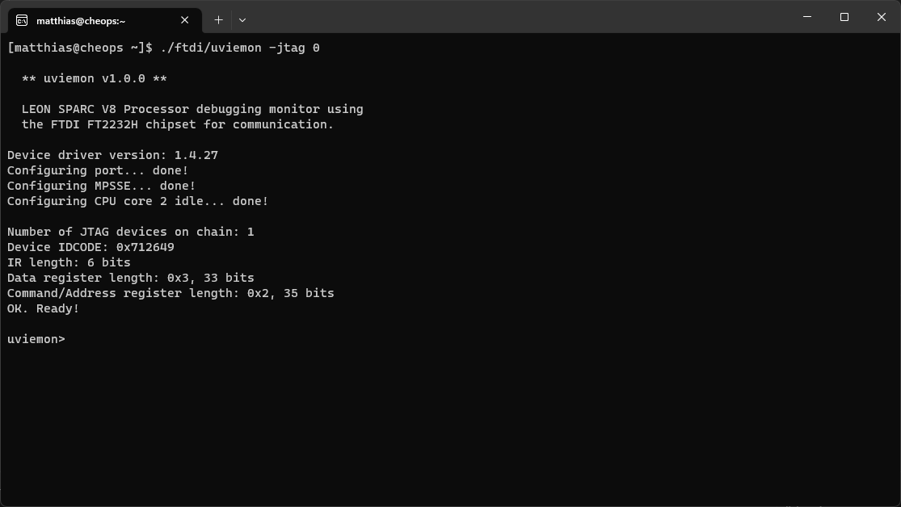

# UVIEMON

Custom software tool for (remote) debugging of the dual-core LEON3-FT GR712RC processor used in the SMILE mission Soft X-ray Imager data processing unit. The Solar wind Magnetosphere Ionosphere Link Explorer, or SMILE -- is a joint mission between the European Space Agency (ESA) and the Chinese Academy of Sciences (CAS).

Due to some issues with the manufacturer-supplied software GRMON, a new program had to be developed in order to simplify remote debugging and create a less locked-down debugging environment. The open-source approach also opens up the possibility of expanding on top of the now existing code base in the future. UVIEMON as a tool is designed to enable low-level software debugging over JTAG via an FT2232H chip or similar.



## Usage

```text
g++ -o uviemon *.cpp *.c -L./lib/ftdi/build/ -lftd2xx -lreadline -Wall -O -pthread -std=c++14
```

**Uses git submodules for some of the included libraries!** After pulling this repo, don't forget to init and update all the submodules:

```text
git submodule update --init --recursive
```
